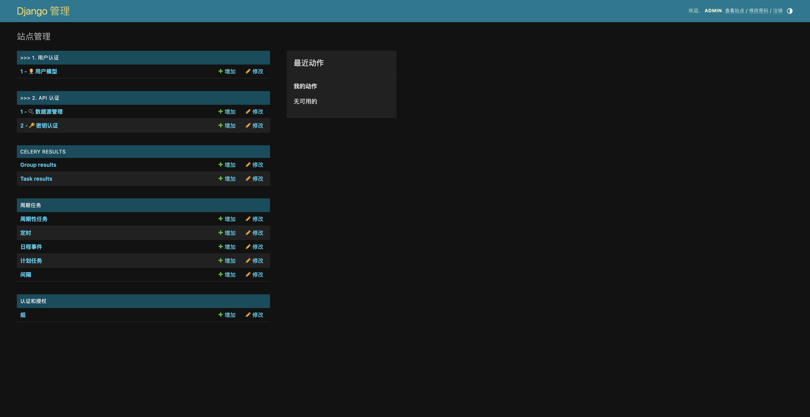

# Django Dance Starter Template

> Based on django-admin startproject template, but with some basic configurations.

## How To Start?

1. Clone this repo
2. Rename `djDancer` to your project name
3. Search '!!!' in the code and replace with yours
4. modify `.envrc.example` to your `.envrc`
5. Run `direnv allow`

## How To Build?

> [Cloud Native Build Packs Installation](https://buildpacks.io/docs/for-platform-operators/how-to/integrate-ci/pack/)

> Suggested [Paketo Builder](https://paketo.io/)

```shell
# Mac OSX Examle

# install pack cli
brew install buildpacks/tap/pack

# build image
pack build --builder paketobuildpacks/builder-jammy-full djDancer:latest
```

## 0. Catalog

1. [Structure](?tab=readme-ov-file#1-structure)
2. [Settingup](?tab=readme-ov-file#2-setting-up)
3. [Screenshots](?tab=readme-ov-file#3-screenshots)
4. [Contributing](?tab=readme-ov-file#4-contributing)
5. [Support](?tab=readme-ov-file#5-support)
6. [Sponsors](?tab=readme-ov-file#6-sponsors)

## 1. Structure

```shell
# tree -L 1 .
.
├── CONTRIBUTING.md
├── Makefile
├── Procfile          # CNB build config
├── README.md
├── apps              # django apps
├── configs           # config files
├── djDancer           # project name, Must be Changed
├── gunicorn.conf.py  # gunicorn config
├── manage.py
├── .cursorrules      # cursor editor prompt
└── requirements.txt
```

## 2. Setting up

### 1. Dev Container(Suggestted)

1. Install Docker in Local Machine
2. Install [Dev Container Extension](https://marketplace.visualstudio.com/items?itemName=ms-vscode-remote.remote-containers) in VSCode

### 2. Local Development

#### 2.1. create virtualenv

> [REF: pyenv installation guide](https://github.com/pyenv/pyenv-installer)

```shell
# install python interpreter
pyenv install 3.10.13

# create virtual env
pyenv virtualenv 3.10.13 djDancer

# activate virtual env
pyenv local djDancer
```

#### 2.2. install dependencies

```shell
pip install -r requirements.txt
```

#### 2.3. local env

> [REF: direnv installation](https://github.com/direnv/direnv)

```shell
# create env file
echo "export RUN_ENV=DEVELOP" > .envrc
echo "export SECRET_KEY=xxxxx" >> .envrc

# apply env
direnv allow
```

#### 2.4. run server

```shell
make migrations
python manage.py migrate
python manage.py createsuperuser --username admin --email admin@admin.com --phone 18888888888
python manage.py runserver 0.0.0.0:8000
```

## 3. Screenshots

> ### 1. Admin Page



> ### 2. Swagger API Page


## 4. Contributing

## 5. Support

## 6. Sponsors
